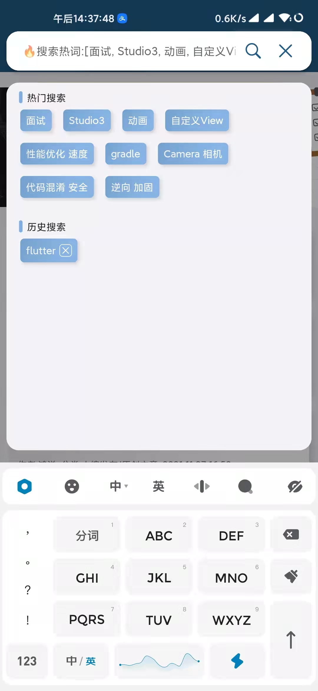
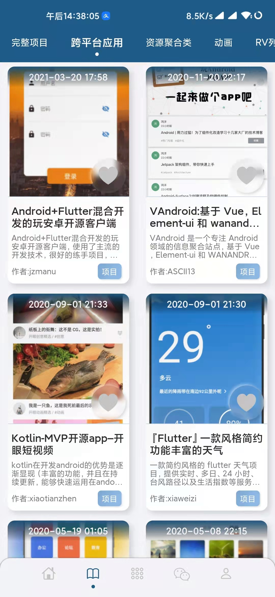
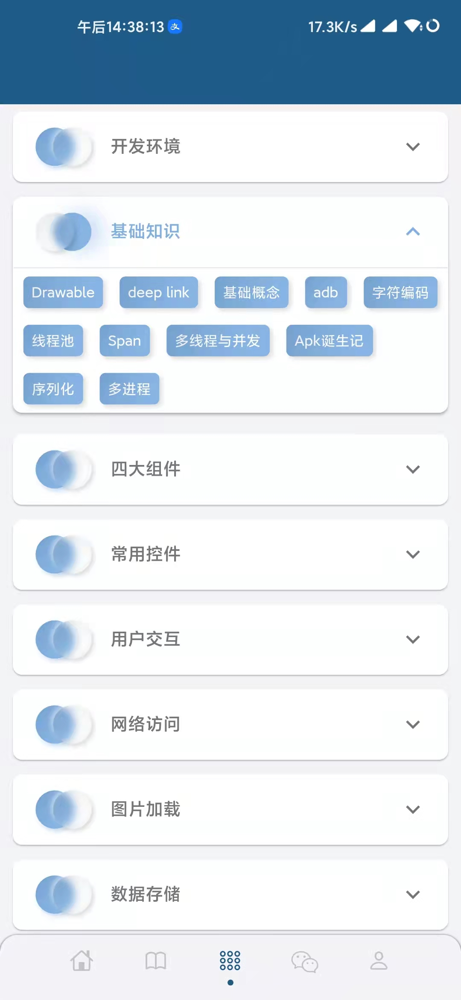

# WanAndroidGetX

[](https://flutter.cn/docs/development/tools/sdk/releases)
- [WanAndroid](https://www.wanandroid.com/)

Flutter和GetX练手的一个项目  功能目前还不完善 日常看下文章还是可以的 有时间的话会继续完善功能

# API

- [感谢鸿洋大神提供的API](https://www.wanandroid.com/blog/show/2)

# 参考(有些忘记了的 找到了会加上)

- [yuexunshi/todo](https://github.com/yuexunshi/todo)
- [openjmu/OpenJMU](https://github.com/openjmu/OpenJMU)
- [xdd666t/getx_template](https://github.com/xdd666t/getx_template)

# APP体验

- [app](assets/app.apk)

# 截图展示

|  |  |  |
| ------------------------------------------------------------ | ------------------------------------------------------------ | ------------------------------------------------------------ |
|  |  |

# 使用开源库
```
  # getx 状态管理框架 https://pub.flutter-io.cn/packages/get
  get: 4.2.0
  # 网络请求 https://pub.flutter-io.cn/packages/dio
  dio: ^4.0.0
  #  # 检测网络连接 https://pub.flutter-io.cn/packages/connectivity_plus
  #  connectivity_plus: ^1.0.4
  # Dart 中http请求的cookie管理器 https://pub.flutter-io.cn/packages/cookie_jar
  cookie_jar: ^3.0.1
  # Dio HTTP 缓存拦截器 https://pub.flutter-io.cn/packages/dio_cache_interceptor
  dio_cache_interceptor: ^2.3.1
  # Dio的 cookie 管理器 https://pub.flutter-io.cn/packages/dio_cookie_manager
  dio_cookie_manager: ^2.0.0
  # 用于在文件系统上查找常用位置 https://pub.flutter-io.cn/packages/path_provider
  path_provider: ^2.0.2
  # 好看的log https://pub.flutter-io.cn/packages/logger
  logger: ^1.0.0
  # Dart 编写的轻量级且快速的键值数据库 https://pub.flutter-io.cn/packages/hive
  hive: ^2.0.4
  hive_flutter: ^1.1.0
  # 封装好的网络日志 https://pub.flutter-io.cn/packages/pretty_dio_logger
  pretty_dio_logger: ^1.1.1
  # 屏幕适配方案 https://pub.flutter-io.cn/packages/flutter_screenutil
  flutter_screenutil: ^5.0.0+2
  # flutter使用svg https://pub.flutter-io.cn/packages/flutter_svg
  flutter_svg: ^0.22.0
  # 方便使用的toast https://pub.flutter-io.cn/packages/oktoast
  oktoast: ^3.0.0
  # 持久化 多样式的底部导航栏 https://pub.flutter-io.cn/packages/persistent_bottom_nav_bar
  persistent_bottom_nav_bar: ^4.0.2
  # 拟态  https://pub.dev/packages/flutter_neumorphic
  flutter_neumorphic: ^3.2.0
  # 浮动搜索栏 https://pub.flutter-io.cn/packages/material_floating_search_bar
  material_floating_search_bar:
    git:
      url: https://gitee.com/wjianhang/material_floating_search_bar
      ref: a13127c645c77d7ab56beaa50c9b679c5c476083
  # 下拉刷新 https://pub.dev/packages/pull_to_refresh
  pull_to_refresh: ^2.0.0
  # 支持空安全的swiper https://pub.dev/packages/flutter_swiper_null_safety
  flutter_swiper_null_safety: ^1.0.2
  #支持图片缓存的图片加载库 https://pub.dev/packages/cached_network_image
  cached_network_image: ^3.0.0
  # 功能更丰富的webView https://pub.dev/packages/flutter_inappwebview
  flutter_inappwebview: ^5.3.2
  # 仿掘金推特点赞按钮 https://pub.flutter-io.cn/packages?q=likebutton
  like_button: ^2.0.2
  # xml到json的解析包 https://pub.flutter-io.cn/packages/xml2json
  xml2json: ^5.3.1
  # 微光效果 用来做骨架屏 https://pub.flutter-io.cn/packages/shimmer
  shimmer: ^2.0.0
  # 动画按钮 https://pub.dev/packages/argon_buttons_flutter
  argon_buttons_flutter: ^1.1.0
  # 瀑布屏布局 https://pub.flutter-io.cn/packages/flutter_staggered_grid_view
  flutter_staggered_grid_view: ^0.4.0
  # html 转义 https://pub.flutter-io.cn/packages/html
  html: ^0.15.0
  # ExpansionPanelList扩展 https://pub.flutter-io.cn/packages/expansion_tile_card
  expansion_tile_card: ^2.0.0
```


MIT License

Copyright (c) 2021 wjianhang
